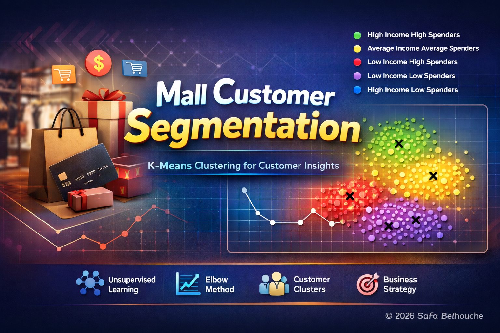
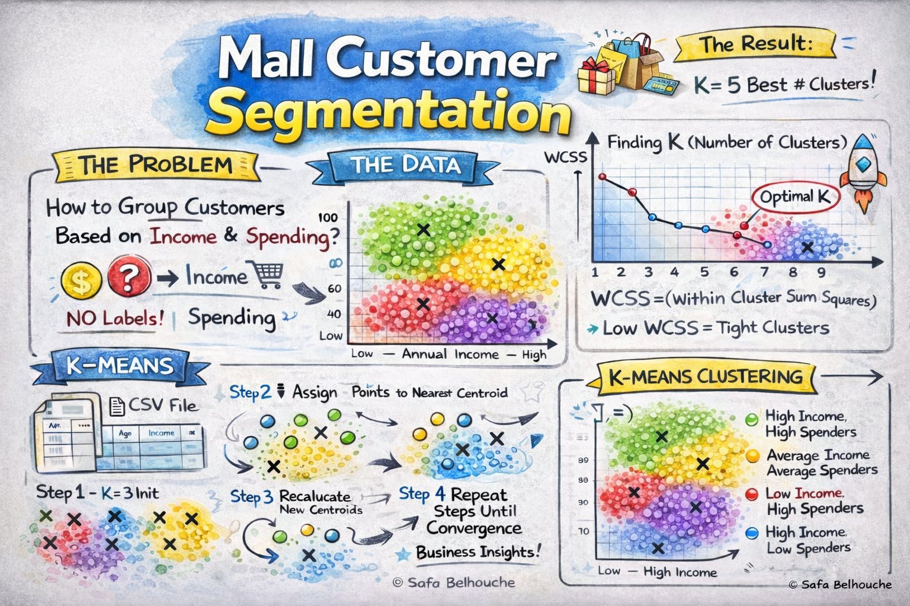
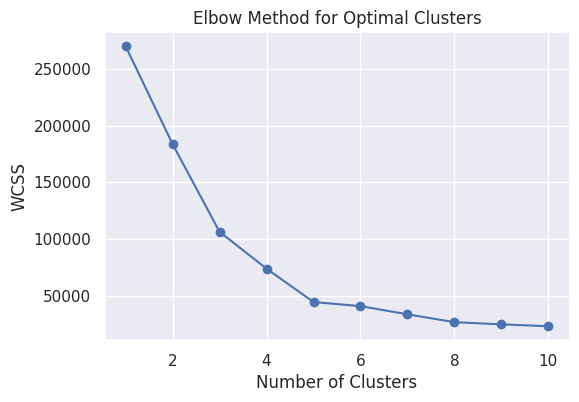
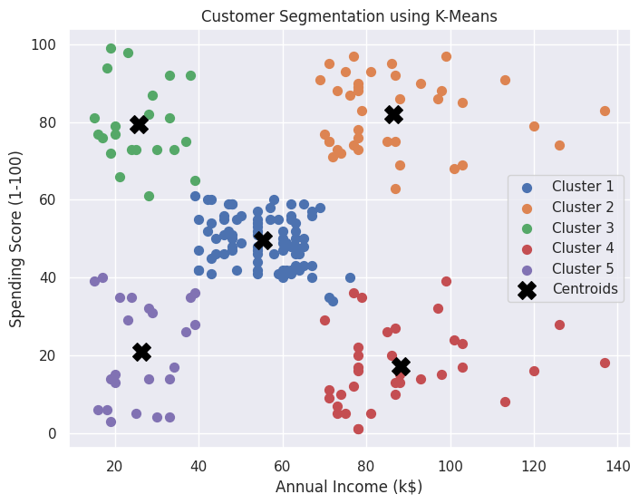

# 🛍️ Mall Customer Segmentation using K-Means Clustering



[](https://colab.research.google.com/drive/1SXgaULEUeYFbs2fgzawI-N__qPXbdvPH?usp=sharing)

---

## 📌 Project Overview

This project implements a **Machine Learning Clustering Model** to segment mall customers into distinct groups based on their purchasing behavior.

Unlike classification problems, this is an **Unsupervised Learning Task** because:

* 🎯 There is **no target variable**
* 📊 The goal is to discover **hidden patterns** in the data
* 👥 Customers are grouped based on similarity

The model uses **K-Means Clustering**, one of the most popular algorithms for customer segmentation.

---

## 🧠 Visual Explanation



This infographic summarizes:
- The business problem
- Feature selection
- Data processing
- K-Means clustering workflow
- Elbow method intuition
- Final customer segments

---


## 📊 Dataset Information

The dataset contains mall customer information.
For segmentation, we focus on:

* 💰 **Annual Income (k$)** – Customer yearly income
* 🛍️ **Spending Score (1–100)** – Score assigned by the mall based on customer behavior

### 🎯 Why These Features?

* Income indicates **purchasing power**
* Spending Score reflects **buying behavior**
* Together, they help identify valuable customer groups

The dataset is clean and suitable for clustering analysis.

---

## ⚙️ Technologies & Libraries

* **Python 🐍**
* **NumPy** (`numpy`) – Numerical operations
* **Pandas** (`pandas`) – Data manipulation
* **Seaborn** (`seaborn`) – Visualization
* **Matplotlib** (`matplotlib`) – Graph plotting
* **Scikit-Learn** (`sklearn`) – K-Means clustering implementation

---

## 🚀 Getting Started

### 1️⃣ Clone the Repository

```bash
git clone https://github.com/SafaBelh/Mall-Customer-Segmentation
cd Mall-Customer-Segmentation
```

### 2️⃣ Install Dependencies

```bash
pip install -r requirements.txt
```

Or manually install:

```bash
pip install numpy pandas matplotlib seaborn scikit-learn
```

### 3️⃣ Run the Project

```bash
python customer_segmentation.py
```

Or open the Jupyter Notebook in Google Colab.

---

## 📈 Understanding K-Means Clustering

### 🧠 What is K-Means?

**K-Means** is an unsupervised algorithm that:

1. Chooses **K** (number of clusters)
2. Randomly initializes **centroids**
3. Assigns each data point to the nearest centroid
4. Recalculates centroids
5. Repeats until convergence

The result: customers are grouped into clusters with similar behavior.

---

## 📊 WCSS & The Elbow Method

### 🔹 What is WCSS?

**WCSS = Within-Cluster Sum of Squares**

It measures how compact the clusters are.

Mathematically:

WCSS = Sum of (Distance between each point and its cluster centroid)²

* Lower WCSS → Tighter clusters
* Higher WCSS → Poor clustering

---

### 🔹 Why Do We Use the Elbow Method?

We compute WCSS for different values of **K (1 to 10)** and plot it.



### How to Interpret:

* At first, WCSS decreases rapidly
* After a certain K, the decrease slows down
* The "elbow point" is the optimal number of clusters

In this project:

👉 **Optimal K = 5**

---

## 👥 Customer Segments Identified

After applying K-Means with **K = 5**, we obtain:

| Cluster       | Interpretation                                        |
| ------------- | ----------------------------------------------------- |
| 💎 Cluster 1  | High Income – High Spending (Premium Customers)       |
| 🛍️ Cluster 2  | Low Income – High Spending (Impulse Buyers)           |
| 💼 Cluster 3  | High Income – Low Spending (Careful Investors)        |
| 💰 Cluster 4  | Low Income – Low Spending (Budget Customers)          |
| 👥 Cluster 5  | Average Income – Average Spending (Regular Customers) |

---

## 📊 Cluster Visualization



### 🔎 How to Read the Graph

* Each color = One cluster
* Each point = One customer
* Black "X" = Cluster centroid
* Customers close together behave similarly

Well-separated clusters indicate strong segmentation.

---

## 🎓 Educational Concepts Covered

* Unsupervised Learning
* Clustering vs Classification
* K-Means Algorithm
* Centroids & Distance Metrics
* WCSS (Within Cluster Sum of Squares)
* Elbow Method
* Data Visualization for Clustering
* Business Interpretation of Clusters

---

## 💼 Business Applications

Customer segmentation helps businesses:

* 🎯 Target high-value customers
* 📢 Personalize marketing campaigns
* 💸 Optimize discount strategies
* 📊 Improve retention programs
* 📦 Develop product strategies

---

## 🔮 Future Improvements

* 📊 Add Silhouette Score for better cluster validation
* 🔍 Try Hierarchical Clustering
* 🧠 Apply PCA for dimensionality reduction
* 🚀 Build interactive dashboard (Streamlit)
* 🤖 Deploy segmentation API

---

## 🔥 Extra Explanation (Deep Dive)

### Why K-Means works well here?

Because:

* Data is numerical
* Only 2 features → Easy geometric separation
* Customer behavior naturally forms groups

---

### Why does WCSS always decrease?

Because:

* More clusters = smaller groups
* Smaller groups = shorter distances
* Shorter distances = lower WCSS

But too many clusters = over-segmentation.

That's why we use the **Elbow Method**.

---

## 👩‍💻 Author

**Safa Belhouche**

© 2026 Safa Belhouche — All Rights Reserved